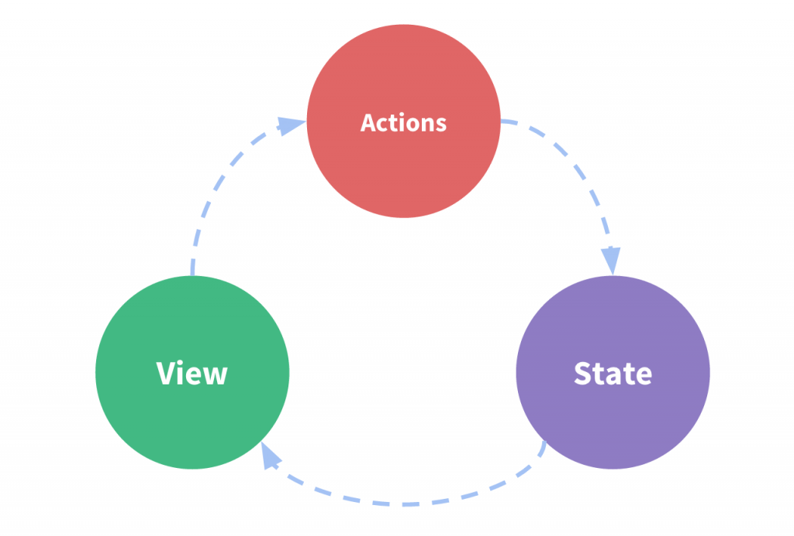

# Использование

Данный модуль обеспечивает работу **UI слоя**.

Слой представления можно разбить на следующие под-слои:
* слой Presenter;
* слой View;

#### Presenter

Основной частью этого слоя являются презентеры экранов,
содержащие всю логику соответствующего экрана.
Все презентеры должны быть унаследованы от класса **BasePresenter**.

Презентеры не уничтожаются при изменении конфигурации.
Этот механизм реализован с помощью сохранения всего Dagger-компонента
экрана и переиспользования его для воссозданного View.
Презентер уничтожается при полном уничтожении экрана (например после `Activity#finish()`).

Для оповещения вью об изменения состояния используется одна модель `extends ScreenModel`),
которая передается в метод вью `#render()`. Модель при отрисовке должна
полностью переводить вью в необходимое состояние,
никакой другой механизм для изменения состояния вью использовать запрещено.
Разовое отображение SnackBar и другие разовые действия не относятся к состоянию.
Предусмотрены базовые классы ScreenModel,
поддерживающие различные состояния, например LoadState (состояние плейсхолдера).
Работают в связке с соответствующим базовым классом Вью.

Если какое либо конкретная часть состояния вью выводится из данных ScreenModel,
то метод вывода этого состояния должен быть в ScreenModel,
например: ScreenModel содержит модель корзины, которая в свою очередь
содержит информацию об акциях.
Если в зависимости от наличия акций необходимо показывать на UI блок с акциями,
то ScreenModel должен содержать метод `boolean shouldRenderActions()`,
в котором будет проверка акций.
Или если другими словами, **оставляем во вью как можно меньше логики,
чтобы потом можно было протестировать ее Unit тестами**.

Когда View становится готовой к работе, у презентера вызываются методы:
- `#onFirstLoad()` - первый запуск экрана - первичная загрузка данных;
- `#onLoad()` - запуск экрана - действия при каждой загрузке(отрисовкка состояния);

Презентер имеет методы для отслеживания жизненого цикла View. А также может быть
делегатом (см. [Делегаты TODO]()).

**Presenter может взаимодействовать с асинхронными задачами только через Rx**.
Для подписки на асинхронную задачу следует вызвать один из методов презентера `#subscribe()`.
Подписка, созданная таким образом, обладает следующими свойствами:
- Происходит заморозка Rx событий (onNext, onError, onComplete)
перед уничтожением View и разморозка после ее воссоздания.
Это свойство необходимо для предотвращении обработки событий,
когда Presenter не имеет ссылки на View.
- Происходит заморозка Rx событий на `#onPause` и разморозка на `#onResume`.
Это свойство позволяет предотвращать обработку событий невидимыми экранами
(например, когда экран находится в стеке).
- Происходит отписка всех Rx подписок при полном уничтожении экрана.

Передача в Presenter аргумента переданного в Intent или Bundle
при старте экрана должна производиться через Dagger.

Для сетевых запросов в презентере предусмотрены методы `#subscribeIoHandleError()`,
содержащие стандартный обработчик ошибок сетевых запросов.
При этом обработчик ошибки можно заменить переписав метод `BasePresenter#handleError()`.

Все варианты методов #subscribe() перед подпиской переводят Observable в mainThread (.observeOn(...)).
Кроме того, все варианты методов `#subscribeIoHandleError()`
производят подписку на Observable в рабочем потоке (.subscribeOn(...)).

Также к слою Presenter относятся классы с логикой UI части приложения,
такие как Navigator( см. [Навигация core-ui]()).
Эти классы также поставляются Dagger и не должны иметь прямую ссылку на Activity,
View и другие части, которые могут стать невалидными при смене конфигурации.
Однако для доступа к функционалу этих частей можно использовать классы FragmentProvider и
ActivityProvider, которые поставляют валидные Fragment и Activity при каждом вызове #get().

Api презентера может иметь только методы вида **`void someMethod(params...)`**,
это необходимо для соответствия принципу **unidirection data flow**

#### ScreenModel
Для хранения состояния экрана используются модели экрана - ScreenModel.
Они переживают смену ориентации и другие события ЖЦ.

Основные классы:
* ScreenModel - базовая модель экрана
* LdsScreenModel - модель экрана с поддержкой состояния загрузки
* LdsSwrScreenModel - поддерживает ПТР
* LdsPgnScreenModel - поддерживает состояние пагинации
* LdsSwrPgnScreenModel - поддерживает и ПТР и пагинацию

Для использования наконкретном экране необходимо наследоваться от одного из этих классво ,
учитывая их специфику.

#### View

**TODO**: многое уже не актуально

Слой View является максимально пассивным и выполняет 2 задачи:
- Показывает информацию пользователю;
- Передает пользовательские события в Presenter.

Для создания View экрана следует наследоваться от одного из классов:
Base(Core)Activity...View или Base(Core)Fragment...View.
см типы базовых классов вью

Если какая-то область экрана (View) является логически связанной,
то следует обернуть ее в кастомную android.ViewGroup,
даже если она не будет переиспользоваться на других экранах.
Взаимодействие частей View (например Adapter, кастомная android.View)
напрямую с презентером запрещено.
Только View может взаимодействовать с презентером. -> Widgets!!!!!

**Ниже исправить - уже по-другому.**

Также есть возможность использовать презентеры в кастомных android.View,
для этого следует заинжектить этот презентере в базовую вью
(Activity или Fragment реализующие интерфейс PresenterHolderCoreView)
и переопределить метод bindPresenters,
в котором связать кастомную android.View с презентером

Если экран не содержит логики, то следует наследоваться от BaseActivity или BaseFragment.

Api вью может иметь только методы вида void someMethod(params...),
это нужно для соответствия принципу Unidirectional data flow.

##### Базовые классы и интерфейсы вью

##### Классы Activity
Классы указаны в порядке наследования.
* CoreActivityView - Класс с корневой логикой вью
* BaseRenderableActivityView - базовый класс для ActivityView,
поддерживающий отрисовку ScreenModel и обработку ошибок
* BaseLdsActivityView - базовый класс ActivityView c поддержкой
состояния загрузки {@link LoadState}
Используется вместе с PlaceHolderView.
* BaseLdsSwrActivityView
базовый класс ActivityView c поддержкой:
   * состояния загрузки {@link LoadState}
   * состояния SwipeRefresh {@link SwipeRefreshState}
Этот базовый класс можно не использовать если с большой гарантией можно
предвидеть что пользователю не потребуется обновлять контент

##### Классы Fragment
Для фрагментов предусмотрены аналогичные базовые классы.

##### Кастомные вью

Интерфейсы
   * CoreView -базовый интерфейс для всех касмтомных вью
   * PresenterHolderCoreView - может быть использован
   для кастомных android.View c поддержкой презентера.
   * RenderableView - для кастомнх вью с поддержкой отрисовки модели экрана

